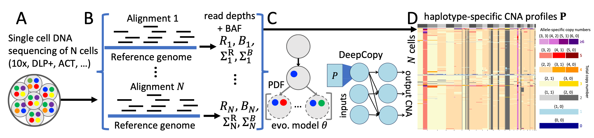

# DeepCopy
DeepCopy is a deep reinforcement learning based evolution-aware algorithm for haplotype-specific copy number calling on single cell DNA sequencing data. 

<p align="center">
  
</p>

## Instalation

DeepCopy can be installed using Bioconda

## Usage

The default usage is: 
```bash
DeepCopy -input <BAM file location> -ref <reference folder location> -output <location to store results>
```

The default input format is a single BAM file with different read groups for different cells. Future updates will also individual BAM files for each cell. 
